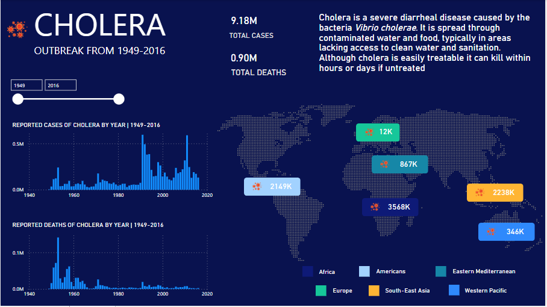

# Cholera Outbreak Analysis

## Introduction
Cholera, a waterborne disease caused by the Vibrio cholerae bacterium, remains a significant public health concern in various regions globally.
As someone with a deep-rooted interest in the healthcare domain, this project is aimed at taking a deeper look into a plethora of information obtained surrounding the virus and its global impact while trying to generate insights and a better understanding of the pandemic.

## About the dataset
The dataset used for this project is from Kaggle and can be found [here](https://www.kaggle.com/datasets/imdevskp/cholera-dataset/data). It consists of data from 1949 till 2016. Contains 6 columns country, year, no. of cases, deaths case fatality ratio and WHO region.

## Skills/Concepts Applied
- Defining KPI
- Cleaning/validation in Power Query.
- Power BI DAX concepts-calculated measures.
- Slicers
- Data Visualization in Power BI.

## Data Cleaning and Transformation
The dataset was imported into Power BI Power Query for data validation and cleaning. Column quality, column profiling and column distribution were selected to get a summary information about each column for effective cleaning. Standardize data formats and resolve inconsistencies for accurate analysis.

## Dashboard

You can interact with the [dashboard here](https://app.powerbi.com/view?r=eyJrIjoiMTc0NzMxYjgtMzUxNi00NWU5LWIyZjAtYmJhZDM5MWFmYzU4IiwidCI6ImU0MmEzYmQ0LWExZDQtNDQ2OS1hNTNjLTMwNmQ3YmUzYmI4NSJ9).

## Key Insights
Looking at the world map, we can see that in several World Health Organization regions, the population that was infected seems to be really high. Africa, Americas, South-East Asia and Eastern Mediterranean are some of those WHO regions.

Africa region had the highest number of cases in the world with over a 3.57 million people infected followed by South-East Asia region.
Steady increase in number of cholera cases, the figure reached peak periods around 1991 to 2011 with an all-time high of 595334 new cases in 1991. Notable event likely to have contributed to the number of cases are: -

1. The Haiti outbreak of 2010-2011, which followed the Haiti earthquake. Large earthquakes can cause population displacement, critical sanitation infrastructure damage, and increased threats to water resources, potentially predisposing populations to waterborne disease epidemics such as cholera.

## Recommendations
**Access to Clean Water**: Being a waterborne disease, cholera can be prevented most effectively with access to clean drinking water.

**Proper Sanitation Facilities**: Cholera can spread very easily if proper sewage and sanitation facilities are not in place or contain defecation.

**Oral Vaccinatio**n: Provision of Oral Cholera vaccine which protection against cholera by stimulating the intestinal immune response. This intestinal immune response limits V. cholerae colonization of the gut if one is subsequently exposed.

## Conclusion
The pandemic had devastating impacts on the lives of so many across the world, a lot of which still affects people to this day. This analysis was meant to explore various patterns and generate insights from the mass of information that was available surrounding the global pandemic and the virus.

